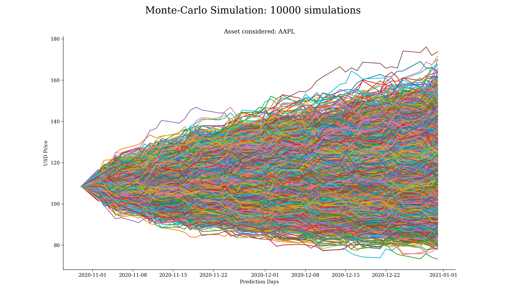
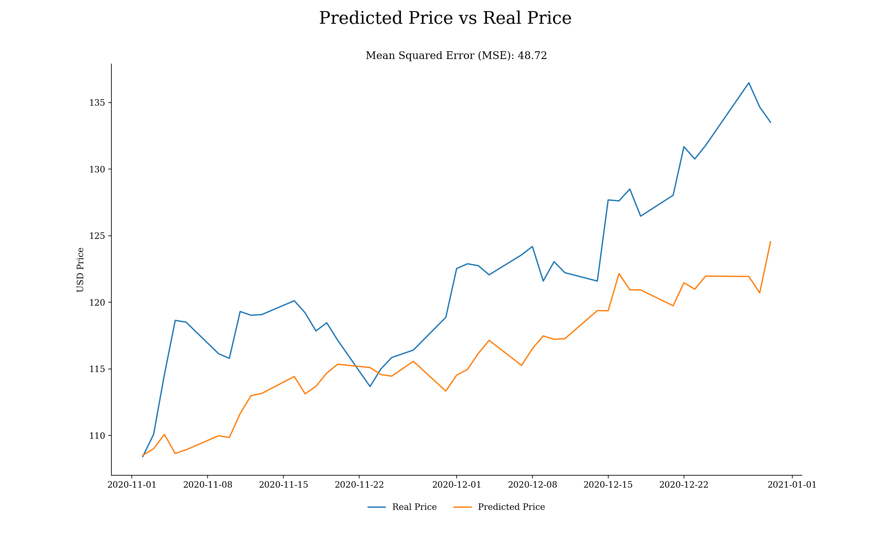

# Simulating stock prices using Geometric Brownian Motion and the Monte Carlo method

#### Last Update March 4, 2021 ####
#### Matteo Bottacini, [matteo.bottacini@usi.ch](mailto:matteo.bottacini@usi.ch) ####


# Project description

In this project it is discussed how to construct a Geometric Brownian Motion (GBM) simulation using Python. 
While building the script, it is also explored the intuition behind the GBM model. 
The simulation model I develop here is a discrete-time model. Therefore, all mathematics discussed here is the discrete-time analogy of GBM for continuous stochastic processes.

# Content
* GBM definition
* Main variables  
* GBM's input parameters
* Drift and Diffusion
* Building the discrete-time GBM model
* Making predictions
* Conclusion


# GBM definition
A GBM is a continuous-time stochastic process in which a quantity follows a Brownian motion (also called a Wiener process) with drift. 
It is an important example of stochastic processes satisfying a stochastic differential equation (SDE); in particular, it is used in mathematical finance to model stock prices in the Black–Scholes model.

# Main variables
Here are retrieved historical stock prices of a specific `stock_name` between `start_date` and `end_date`. 
Then using the GBM model are get the simulations until `pred_end_date`.
The GBM model is then iterated over different possbile scenarios `scen_size`.
Feel free to play with these variables and create different settings.

```python
# main variables

# stock_name    :   ticker symbol from yahoo finance
# start_date    :   start date to download prices (yyyy/mm/dd)
# end_date      :   end date to download prices(yyyy/mm/dd)
# pred_end_date :   date until which you want to predict price (yyyy/mm/dd)
# scen_size     :   different possible scenarios
stock_name    = 'AAPL'
start_date    = '2010-01-01'
end_date      = '2020-10-31'
pred_end_date = '2020-12-31'
scen_size     = 10000
```


# GBM's input parameters
Here are the input parameters that this GBM simulation model will take. 
I will use Apple’s stock prices from `2010-01-01` to `2020-10-31` make predictions up to `2020-12-31`. 
Also, you should note that I talk about trading days when I explain things using dates. By assumption the week is composed of only the weekdays, meaning that what comes after Friday is Monday.
```python
# Parameter Definitions

# So    :   initial stock price
# dt    :   time increment -> a day in our case
# T     :   length of the prediction time horizon(how many time points to predict, same unit with dt(days))
# N     :   number of time points in prediction the time horizon -> T/dt
# t     :   array for time points in the prediction time horizon [1, 2, 3, .. , N]
# mu    :   mean of historical daily returns
# sigma :   standard deviation of historical daily returns
# b     :   array for brownian increments
# W     :   array for brownian path
```

### 1. So
This is the initial stock price. 
Forward stock price simulations take their roots from this initial stock price value. 
This initial value is multiplied with some expressions to get predictions for each of the trading days.
In this case is the closing stock price on October 31, 2020.

```python
So = train_set[-1]
```

### 2. dt
This is the time increment in the model. 
It means the time unit assumed, then the time increment in this model is 1 day. 

```python
dt = 1
```

### 3. T
`T` denotes the length of the prediction time horizon. 
The number of trading days is inferred using the `pred_end_date` variable declared at the beginning. 
Using the code below, the number of trading days this model will predict stock prices for is extracted, by counting the weekdays between `(end_date + 1 day)` and `pred_end_date`. 
In this case it is the number of trading days between 31 October 2020 and 31 December 2020.

```python
n_of_wkdays = pd.date_range(start=pd.to_datetime(end_date,
                                                 format="%Y-%m-%d") + pd.Timedelta('1 days'),
                            end=pd.to_datetime(pred_end_date,
                                               format="%Y-%m-%d")).to_series().map(lambda x: 1 if x.isoweekday() in range(1, 6) else 0).sum()
T = n_of_wkdays
```

### 4. N
This parameter comes automatically after assignment of `dt` and `T`. 
It is the number of time points in the prediction time horizon. 
```python
N = T / dt
```

### 5. t
This is an array where are shown the time progression in this model.
```python
t = np.arange(1, int(N) + 1)
```

### 6. mu
This is the mean return of the stock prices within the historical date range selected. 
Before calculating mu, it's necessary to evalute the return for each trading day
`mu` is then used as the drift component. 
It will have an effect on the long-term movement of the stock price.
The calculation is below.
```python
daily_returns = ((train_set / train_set.shift(1)) - 1)[1:]
mu            = np.mean(daily_returns)
```

### 7. sigma
This is the standard deviation of returns of the stock prices. 
Sigma will contribute by scaling the magnitude of random shock so that the small fluctuations occur in accordance with the historical volatility of the stock prices. 
No irrelevant random values coming from the standard normal distribution are added. Below, you can see how sigma is calculated.
```python
sigma = np.std(daily_returns)
```

### 8. b
This array is the array where randomness is add to the model.  
```python
scen_size = 10000
b         = {str(scen): np.random.normal(0, 1, int(N)) for scen in range(1, scen_size + 1)}
```

### 9. W
`W` is the Brownian path and it determines how the stock prices fluctuate from beginning time point(`So`) to some other time point `t`.
```python
W = {str(scen): b[str(scen)].cumsum() for scen in range(1, scen_size + 1)}
```

# Drift and Diffusion
The drift is the longer-term trends and the Diffusion is the shorter-term fluctuations.
The drift is mathematically described as:


The diffusion is mathematically described as:

```python
drift     = (mu - 0.5 * sigma ** 2) * t
diffusion = {str(scen): sigma * W[str(scen)] for scen in range(1, scen_size + 1)}
```

# Building the discrete-time GBM model
The GBM model is the following:

And it is such that each point is derived as:


```python
S = np.array([So * np.exp(drift + diffusion[str(scen)]) for scen in range(1, scen_size + 1)])
S = np.hstack((np.array([[So] for scen in range(scen_size)]), S)) 
```
Here is the plot of the Monte-Carlo Simulation:



# Making predictions
Finally, here are achieved the performances of the model by looking at the best and worst scenario simulated each day and averaging the expectations.
Since we don't know how the future looks like, according to the no-arbitrage conditions, we give same 50% chances to both scenarios.
Then also the Mean Squared Error (MSE) is evaluated.
```python
S_max          = [S[:, i].max() for i in range(0, int(N))]
S_min          = [S[:, i].min() for i in range(0, int(N))]
S_pred         = .5 * np.array(S_max) + .5 * np.array(S_min)
final_df       = pd.DataFrame(data=[test_set.reset_index()['Adj Close'], S_pred],
                              index=['real', 'pred']).T
final_df.index = test_set.index
mse            = 1/len(final_df) * np.sum((final_df['pred'] - final_df['real']) ** 2)
```
Here is the final plot:



# Conclusion
In this project, I've learned how to build a simulation model for stock prices using Geometric Brownian Motion in discrete-time context. 
In each run, you will get different stock price scenarios. It is because we use `np.random.normal()` without setting seed. 
Each time we run the model, we will have a different array `W` and it will result in different predictions.
Geometric Brownian Motion helps us to see what paths stock prices may follow and lets us be prepared for what is coming. 
Of course, it is never possible to predict the exact future, but these statistical methods give us the chance of creating sound trading and hedging strategies that we can rely on.

# Supported versions
This configuration has been tested against Python 3.8
